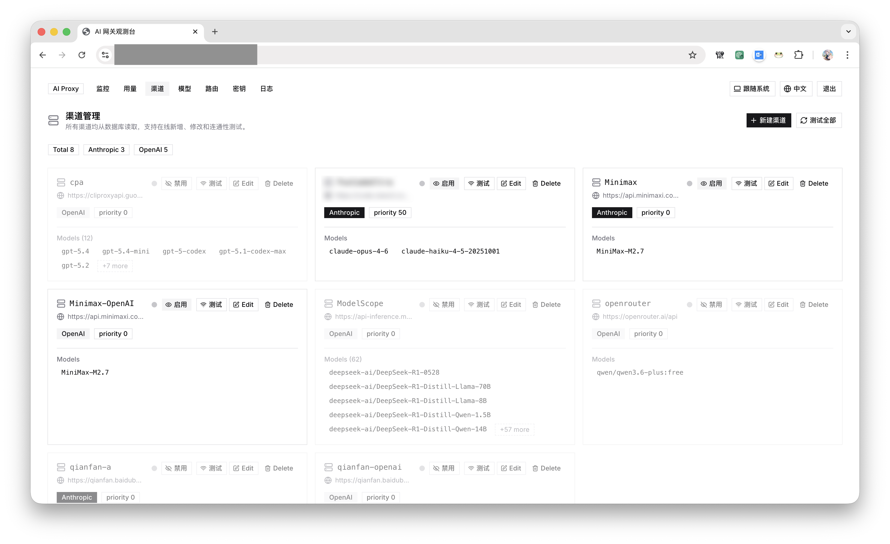
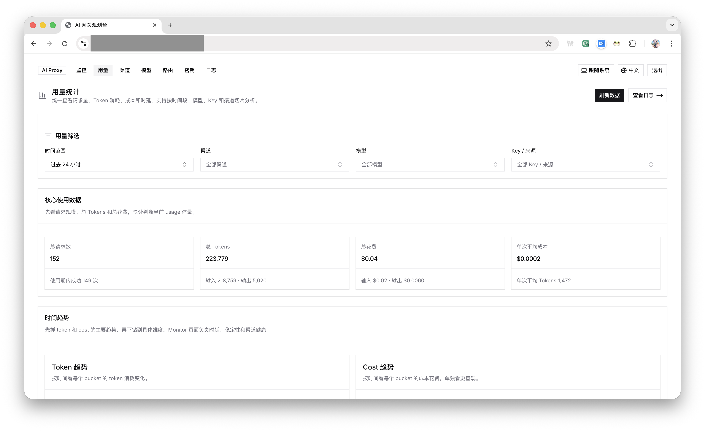
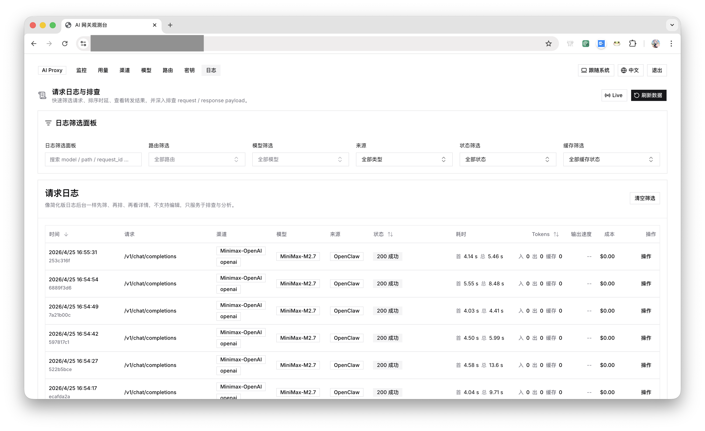

# LRS — LLM Relay Service

> 自托管 LLM 中继网关 + 可观测性控制台

[](LICENSE)
[](https://bun.sh)
[](https://www.typescriptlang.org)

LRS 是一个基于 **Bun + Hono** 的轻量 LLM 中继服务。它将多个 AI 服务商统一在单一入口下，配合内置的 Web 控制台，让你精确观测每一笔请求的延迟、Token 用量与缓存命中情况。

**LRS 的核心设计原则是"纯中继"**：不做任何请求格式转换，客户端发什么就转发什么（仅替换认证头）。这意味着不会出现格式转换引入的字段丢失、流式协议错位等问题，上游支持的所有功能对客户端都是透明可用的。

另一个核心特性是**完整记录每笔请求的原始内容与响应**，包括转发给上游的真实请求体。出现问题时，可以直接在控制台翻日志，对照原始请求和实际转发内容，精准定位是客户端构造有误、还是上游返回异常。

> **适用场景**：LRS 面向个人开发者或小团队内部使用，无注册、邀请、配额等商业化机制，只有单一管理员账户。如果你需要多用户商业分发，可以考虑 NewAPI / One-API 等方案；如果你只是想为自己的工具链搭一个干净、可观测的 LLM 中继，LRS 是更轻量的选择。

| 渠道管理 | 用量统计 | 请求日志 |
|:---:|:---:|:---:|
|  |  |  |

---

## 为什么用 LRS？

| 场景 | LRS 的解法 |
|------|-----------|
| 使用多个 AI 服务商，想统一 API 入口 | 配置多个 Provider，用路径前缀或模型名自动选路 |
| 不想把真实 API Key 暴露给客户端 | 网关代填上游凭证，客户端只需持有网关 key |
| 想知道每次请求耗了多少 token、有没有命中缓存 | 内置控制台展示首 token 延迟、cache 命中率、用量趋势 |
| 多个渠道配置了相同模型，希望优先级可控 | 按 `priority` 字段自动选优先级最高的渠道 |
| 想给特定渠道预置系统提示 | 在 Provider 配置中填写 `systemPrompt`，自动注入 |
| 多个应用共用同一个网关，希望分别统计用量 | 为每个应用生成独立 Key，按 Key 维度过滤用量与日志 |
| 用过其他代理，遇到格式转换导致的兼容性问题 | LRS 不做格式转换，纯透传，上游有什么能力客户端就能用什么 |

---

## 功能

- **纯中继，无格式转换** — 请求原样转发，不引入格式兼容问题
- **全文请求记录** — 保存原始请求体与转发请求体，方便 Debug 和问题排查
- **双协议支持** — 同时兼容 Anthropic 和 OpenAI 格式的上游服务
- **显式前缀路由** — `/providers/{channel}/...` 精确匹配指定渠道
- **模型自动路由** — `/v1/chat/completions` 等标准路径按请求体中的 `model` 自动选路
- **优先级控制** — 同模型多渠道时，按 `priority` 值从高到低选择
- **多 Key 管理** — 为不同应用（如 OpenClaw、Hermes 等）生成独立 Key，分别追踪用量与统计
- **凭证代填** — 网关持有上游 key，客户端只用网关 key 访问
- **系统提示注入** — Anthropic 渠道可配置预置系统提示，与请求中的 `system` 合并
- **模型别名** — 对外暴露自定义模型名，内部映射到真实上游模型
- **CORS 支持** — 内置跨域处理
- **Web 控制台** — 内置可观测性仪表盘

---

## Web 控制台

访问根路径 `/` 即可打开控制台，功能包括：

- **Providers 管理** — 在 UI 中增删改渠道配置，无需重启服务
- **请求日志** — 历史请求列表，可查看原始请求体、转发请求体与响应
- **延迟指标** — 首包时间、首 token 时间、总耗时、生成耗时
- **Token 统计** — input / output / cache token 历史趋势
- **缓存分析** — 对比相邻请求的 `cache_creation_input_tokens` / `cache_read_input_tokens` 差异
- **API Key 管理** — 创建和管理网关访问 key
- **Monitor** — 实时流量概览

> 设置 `PASSWORD` 环境变量可开启登录保护。

---

## 快速开始

### 前置条件

- [Bun](https://bun.sh) >= 1.1
- PostgreSQL 数据库

### 安装与启动

```bash
# 1. 克隆仓库
git clone https://github.com/GoJam11/LLMRelayService.git
cd LLMRelayService

# 2. 安装依赖
bun install

# 3. 配置环境变量（参考 .env.example）
cp .env.example .env
# 编辑 .env，填写 DATABASE_URL 和 GATEWAY_API_KEY

# 4. 初始化数据库
bun run db:migrate

# 5. 启动服务（同时启动后端和前端开发服务器）
bun run dev
```

访问 `http://localhost:3000` 打开控制台，在 Providers 页面添加第一个渠道。

### 其他命令

```bash
bun run dev:server   # 仅启动后端（watch 模式）
bun run dev:client   # 仅启动前端（Vite dev server）
bun run build        # 构建前端静态资源
bun start            # 生产模式启动
bun test             # 运行测试
```

### 生产部署

```bash
# 构建前端并启动服务
bun install && bun run build && bun start
```

Railway / Render 等平台部署时构建命令同上。

### Docker 部署

```bash
# 1. 复制并配置环境变量
cp .env.example .env
# 至少设置 GATEWAY_API_KEY（PASSWORD 可选）

# 2. 启动服务（包含内置 PostgreSQL）
GATEWAY_API_KEY=your-key docker compose up -d

# 或者使用 .env 文件
docker compose up -d
```

访问 `http://localhost:3000` 打开控制台。

> **提示**：如已有外部 PostgreSQL，只需在 `docker-compose.yml` 中删除 `postgres` 服务，并将 `DATABASE_URL` 改为对应连接字符串。

---

## 环境变量

| 变量 | 必填 | 说明 |
|------|------|------|
| `DATABASE_URL` | ✅ | PostgreSQL 连接字符串 |
| `GATEWAY_API_KEY` | ✅ | 客户端访问网关所需的 key |
| `PASSWORD` | — | 控制台登录密码（不设则无需登录）|
| `PORT` | — | 监听端口，默认 `3300` |
| `DEBUG_DB_MAX_RECORDS` | — | 最大保留请求记录数，默认 `50000` |

参考 [`.env.example`](.env.example)。

---

## 路由规则

### 显式前缀路由

```
{METHOD} /providers/{channelName}/{path...}
```

在路径前加 `/providers/` 前缀，直接匹配 `channelName` 对应的渠道，剩余路径原样转发给上游。例如：

```
POST /providers/my-channel/v1/messages
POST /providers/my-channel/v1/chat/completions
```

### 模型自动路由

```
{METHOD} /v1/{path...}
```

读取请求体中的 `model` 字段，在各渠道的 `models` 列表中匹配候选渠道，按 `priority` 由高到低选择。例如：

```
POST /v1/messages
POST /v1/chat/completions
```

### 认证

| 渠道类型 | 客户端传入方式 |
|---------|--------------|
| `anthropic` | `x-api-key: <GATEWAY_API_KEY>` |
| `openai` | `Authorization: Bearer <GATEWAY_API_KEY>` |

网关验证通过后，会用渠道配置的上游凭证替换客户端传入的认证头。

---

## 系统提示注入

在 Provider 配置中填写 `systemPrompt`，网关会在转发前将其并入请求的 `system` 字段。若请求本身已携带 `system`，两者会合并而非覆盖。

---

## 项目结构

```
src/
  index.ts              # Hono 入口，CORS、请求分流、转发逻辑
  config.ts             # 路由解析（resolveRoute / resolveRouteByModel）
  console-ui.ts         # 控制台静态资源托管与 /__console/* API
  providers/            # Anthropic / OpenAI 适配器
  db/                   # Drizzle ORM + PostgreSQL
console/
  ai-proxy-dashboard/   # Vite + React 控制台前端
drizzle/                # 数据库迁移文件
```

---

## License

[MIT](LICENSE)

## Link

[Forum](https://linux.do/t/topic/2056392)
